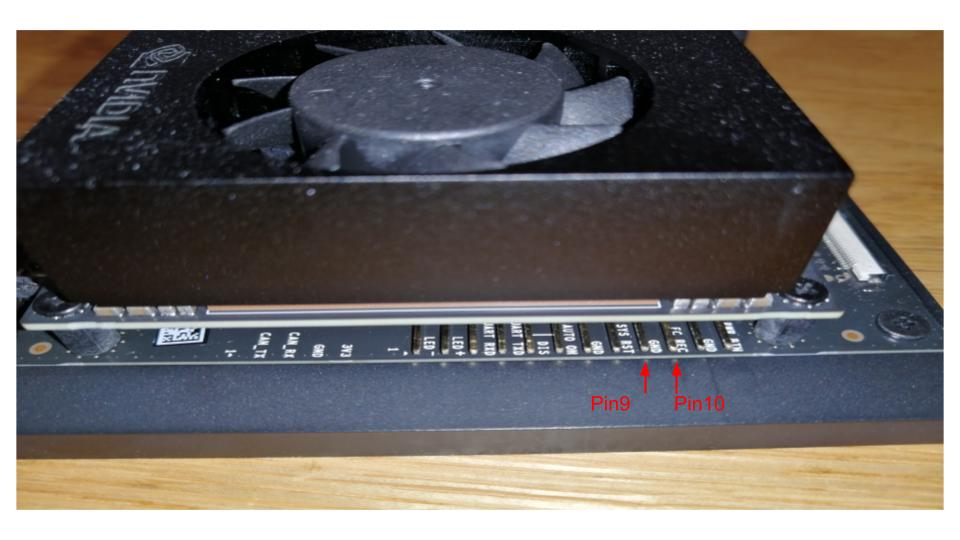
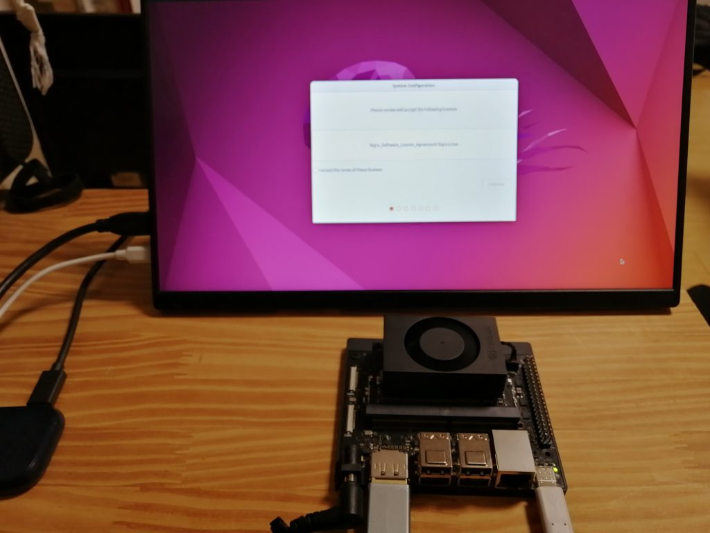

# Flashing the Jetson Orin Nano

This writeup describes how to boot the Jetson Orin Nano from NVMe storage and how to set it up with the CLI instead of using the GUI-based SDK manager.

For the host, use Ubuntu 22.04; for the Jetson Orin Nano, Jetson Linux 36.2 is to be installed.

This is the latest compatible Ubuntu for RealSense and ROS2 Humble.

## Host PC 
Download the *Driver Package (BSP)* and *Sample Root Filesystem* from https://developer.nvidia.com/embedded/jetson-linux-r362 using the following commands:

```
wget https://developer.nvidia.com/downloads/embedded/l4t/r36_release_v2.0/release/jetson_linux_r36.2.0_aarch64.tbz2

wget https://developer.nvidia.com/downloads/embedded/l4t/r36_release_v2.0/release/tegra_linux_sample-root-filesystem_r36.2.0_aarch64.tbz2
```

Unzip the downloaded packages. Note that sudo is required to unzip tegra_linux_sample-root-filesystem:

```
tar xf jetson_linux_r36.2.0_aarch64.tbz2

sudo tar xf tegra_linux_sample-root-filesystem_r36.2.0_aarch64.tbz2 -C Linux_for_Tegra/rootfs/
```

Next, create an image to write to the Jetson Orin Nano:

```
cd Linux_for_Tegra

sudo apt install -y qemu-user-static

sudo ./apply_binaries.sh

sudo apt install -y sshpass abootimg nfs-kernel-server
```
## Jetson

Prepare the NVMe drive by ensuring it is formated to ext4, either by using a USB recovery utility, USB live linux & gparted, or external enclosure. Windows does not format drives to this format.


### Jetson Recovery Mode

Recovery mode is required to flash the device over USB. To go to the Recovery Mode, connect Pin 9 and Pin 10 of J14 with a jumper and turn on the power. The jumper is not included in the Jetson Orin Nano Developer Kit, so you need to prepare it by yourself. 





### Jetson Flashing

Connect the host and Jetson Orin Nano via USB-C, then power up. Execute the following command to confirm that the Jetson Orin Nano is in Recovery Mode:

```
lsusb |grep -i nvidia
```

You should see NVIDIA Corp. APX listed.


Now, flash the NVMe via:

```
sudo ./tools/kernel_flash/l4t_initrd_flash.sh --external-device nvme0n1p1 \
  -c tools/kernel_flash/flash_l4t_external.xml -p "-c bootloader/generic/cfg/flash_t234_qspi.xml" \
  --showlogs --network usb0 jetson-orin-nano-devkit internal
  ```

It may fail after the *Waiting for target to boot-up* messages, however, it usually succeeds on the second attempt after freshly formatted NVMe. 


  It takes about 10 minutes. After writing is complete, you should see a startup screen as shown below. Follow the instructions to complete the setup.

  

  Finish setup, set credentials to **bender** and enable *Log in automatically*.


# Jetson Software Installation

Now that we have Ubuntu 22.04 flashed onto the NVMe, we will now install ROS2 Humble, RealSense API & ROS wrapper, ORBSLAM3, GTSAM, OPENCV, and whatever else. 

Start by:

```
sudo apt-get update
```

#### **Avoid using *apt-get upgrade* as this apparently prevents the system from rebooting.**


## ROS2 Humble

Install ROS2 Humble from https://docs.ros.org/en/humble/Installation/Alternatives/Ubuntu-Development-Setup.html or from the following commands:

```
locale  # check for UTF-8

sudo apt update && sudo apt install locales
sudo locale-gen en_US en_US.UTF-8
sudo update-locale LC_ALL=en_US.UTF-8 LANG=en_US.UTF-8
export LANG=en_US.UTF-8

locale  # verify settings
```

```
sudo apt install software-properties-common
sudo add-apt-repository universe
```

```
sudo apt update && sudo apt install curl -y
sudo curl -sSL https://raw.githubusercontent.com/ros/rosdistro/master/ros.key -o /usr/share/keyrings/ros-archive-keyring.gpg
```

```
echo "deb [arch=$(dpkg --print-architecture) signed-by=/usr/share/keyrings/ros-archive-keyring.gpg] http://packages.ros.org/ros2/ubuntu $(. /etc/os-release && echo $UBUNTU_CODENAME) main" | sudo tee /etc/apt/sources.list.d/ros2.list > /dev/null
```

```
sudo apt update && sudo apt install -y \
  python3-flake8-docstrings \
  python3-pip \
  python3-pytest-cov \
  ros-dev-tools
  ```

  ```
  sudo apt install -y \
   python3-flake8-blind-except \
   python3-flake8-builtins \
   python3-flake8-class-newline \
   python3-flake8-comprehensions \
   python3-flake8-deprecated \
   python3-flake8-import-order \
   python3-flake8-quotes \
   python3-pytest-repeat \
   python3-pytest-rerunfailures
   ```

```
mkdir -p ~/ros2_humble/src
cd ~/ros2_humble
vcs import --input https://raw.githubusercontent.com/ros2/ros2/humble/ros2.repos src
```

```
sudo rosdep init
rosdep update
rosdep install --from-paths src --ignore-src -y --skip-keys "fastcdr rti-connext-dds-6.0.1 urdfdom_headers"
```

The following may take 1.5hrs:
```
cd ~/ros2_humble/
colcon build --symlink-install
```
Now, ROS2 Humble is installed.

Test it by using two terminals to run the following:

Terminal 1:

```
. ~/ros2_humble/install/local_setup.bash
ros2 run demo_nodes_cpp talker
```
Terminal 2:
```
. ~/ros2_humble/install/local_setup.bash
ros2 run demo_nodes_py listener
```

You should see some communication.

## RealSense


Build from source:

```
wget https://github.com/IntelRealSense/librealsense/archive/refs/tags/v2.53.1.zip
```

```
sudo apt-get update
```

```
sudo apt-get install libssl-dev libusb-1.0-0-dev libudev-dev pkg-config libgtk-3-dev
```

```
sudo apt-get install git wget cmake build-essential
```

```
sudo apt-get install libglfw3-dev libgl1-mesa-dev libglu1-mesa-dev at
```

```
git clone https://github.com/IntelRealSense/librealsense.git
```


Unzip v2.53.1.zip and cd

```
./scripts/setup_udev_rules.sh
```

```
sudo apt install v4l-utils
```

```
 ./scripts/patch-realsense-ubuntu-lts-hwe.sh
 ```


navigate to librealsense2 root directoy and run:

``` 
mkdir build && cd build
```

```
cmake ../ -DFORCE_RSUSB_BACKEND=true -DCMAKE_BUILD_TYPE=release -DBUILD_EXAMPLES=true -DBUILD_GRAPHICAL_EXAMPLES=true
```

```
sudo make uninstall && make clean && make && sudo make install
```

```
cd ~/ros2_ws/src/
```

```
git clone https://github.com/IntelRealSense/realsense-ros.git -b ros2-master
```
```
cd ~/ros2_ws
```

```
sudo apt-get install python3-rosdep -y
sudo rosdep init # "sudo rosdep init --include-eol-distros" for Foxy and earlier
rosdep update # "sudo rosdep update --include-eol-distros" for Foxy and earlier
rosdep install -i --from-path src --rosdistro $ROS_DISTRO --skip-keys=librealsense2 -y
```

This will take an hour and 10mins:

```
colcon build
```

```
ROS_DISTRO=humble 
source /opt/ros/$ROS_DISTRO/setup.bash
cd ~/ros2_ws
. install/local_setup.bash
```

Then test by launching then echoing a RealSense topic in another terminal:

```
ros2 launch realsense2_camera rs_launch.py
```


```
source ~/ros2_humble/install/setup.bash
source /opt/ros/humble/setup.bash
ros2 topic hz /camera/camera/color/image_raw
```

Success.

## ORBSLAM3
Visual-Inertial SLAM library for visual odometry
### opencv4.2.0

```
git clone https://github.com/opencv/opencv.git
cd opencv
git checkout 4.2.0
```

```
sudo apt-get update
sudo apt-get install -y build-essential cmake git libgtk2.0-dev pkg-config libavcodec-dev libavformat-dev libswscale-dev
```

Edit the necessary CMakeLists.txt files to correct the compiler options
```
nano ./3rdparty/carotene/CMakeLists.txt
```
#### Replace `ipcp-unit-growth` with `ipa-cp-unit-growth` in the following line:
#### set_source_files_properties(${carotene_sources} COMPILE_FLAGS "--param ipcp-unit-growth=100000 --param inline-unit-growth=100000 --param large-stack-frame-growth=5000")


```
nano ./3rdparty/carotene/hal/CMakeLists.txt
```
#### Replace `ipcp-unit-growth` with `ipa-cp-unit-growth` in the following line:
#### set_source_files_properties(impl.cpp $<TARGET_OBJECTS:carotene_objs> COMPILE_FLAGS "--param ipcp-unit-growth=100000 --param inline-unit-growth=100000 --param large-stack-frame-growth=5000")


you also might get an error like:

```
/home/bender/opencv/modules/gapi/test/gapi_async_test.cpp:456:26: error: ‘sleep_for’ is not a member of ‘std::this_thread’
  456 |        std::this_thread::sleep_for(std::chrono::milliseconds{2});            
```

so nano the file and add 

```
#include <thread>
```
using
```
sudo nano /home/alex/Downloads/opencv-4.2.0/modules/gapi/test/gapi_async_test.cpp
```
the rebuild:

```
cmake -D CMAKE_BUILD_TYPE=Release -D WITH_CUDA=OFF -D CMAKE_INSTALL_PREFIX=/usr/local ..

sudo make install
```


### pangolin

```
git clone https://github.com/stevenlovegrove/Pangolin.git
cd Pangolin
mkdir build
cd build
cmake ..
cmake --build .
```


### orbslam3 install
clone and install from:

[ORB-SLAM3-STEREO-FIXED](https://github.com/zang09/ORB-SLAM3-STEREO-FIXED)

```
git clone https://github.com/zang09/ORB-SLAM3-STEREO-FIXED.git ORB_SLAM3
```

You might modify the build.sh script to use one thread, i.e. -j1 as opposed to -j or -j4. Compiling with more than one thread fills up the ram space too quick and crashes the process.

```
cd ORB_SLAM3
chmod +x build.sh
./build.sh
```

#### modify System.cc and System.h
In ~/ORB_SLAM3/src/System.cc under the function:
```
bool System::isFinished()
{
    return (GetTimeFromIMUInit()>0.1);
}
```
paste: 
```
Frame System::GetCurrentFrame()
{
    unique_lock<mutex> lock(mMutexState);
    return mpTracker->mCurrentFrame;
}
```
In ~/ORB_SLAM3/include/System.h in public under the function. for example:
```
void ChangeDataset();
```
paste:
```
Frame GetCurrentFrame();
```

then rebuild with:
```
cd ORB_SLAM3

chmod +x build.sh

./build.sh
```
### ros2 wrapper:
#### create workspace:

```
mkdir -p colcon_ws/src && cd colcon_ws
colcon build
source install/local_setup.bag && source install/setup.bash
```
#### then clone into ~/colcon_ws/src
then update PYTHONPATH in CMakeLists.txt to correct ROS distro and python version.

then update ORB_SLAM3_ROOT_DIR in FindORB_SLAM3.cmake

then specify coordinate system that we want within orbslam within the file:

```
sudo nano ~/bender_ws/src/ORBSLAM3_ROS2_wrapper/src/stereo/common.cpp 

```

by enabling:
```
// Inverse matrix
  tf_camera_rotation = tf_camera_rotation.transpose();
   tf_camera_translation = -(tf_camera_rotation * tf_camera_translation);
```

then build with

```
source /opt/ros/humble/setup.bash
source ~/ros2_humble/install/setup.bash

colcon build --symlink-install --packages-select orbslam3
```
colcon build may fail due to RAM limitation:

1. Run Command Below
```
sudo apt-get install -y dphys-swapfile
```
2. Run `sudo gedit /sbin/dphys-swapfile`
3. Change `CONF_MAXSWAP` to 4096, save and exit
4. Run `sudo nano /etc/dphys-swapfile`
5. Enable `CONF_SWAPSIZE` and put 4096, save and exit
6. Run `sudo reboot .` to restart Jetson Nano
7.Run `free -m` and check the Swap total

then colcon build again. then unzip the vocabulary file

```
tar -xvzf ORBvoc.txt.tar.gz
```
Test stuff:

```
source /opt/ros/humble/setup.bash
source ~/ros2_humble/install/setup.bash
source ~/bender_ws/install/setup.bash
```

visible camera only:
```
ros2 launch realsense2_camera rs_launch.py enable_depth:=false enable_infra1:=false enable_infra2:=false enable_fisheye:=false enable_confidence:=false enable_color:=true pointcloud.enable:=false align_depth.enable:=false rgb_camera.color_profile:=640x480x30

```
infrared stereo only:
```
ros2 launch realsense2_camera rs_launch.py enable_depth:=false enable_infra1:=true enable_infra2:=true enable_fisheye:=false enable_confidence:=false enable_color:=false pointcloud.enable:=false align_depth.enable:=false depth_module.infra_profile:=424x240x30


```

full power rgb and lowest infrared

```
ros2 launch realsense2_camera rs_launch.py enable_depth:=false enable_infra1:=true enable_infra2:=true enable_fisheye:=false enable_confidence:=false enable_color:=true pointcloud.enable:=false align_depth.enable:=false depth_module.infra_profile:=424x240x30 rgb_camera.color_profile:=1920x1080x30

```


Run orbslam. make sure the resolution above matches the calibration info!
```
ros2 run orbslam3 stereo /home/bender/bender_ws/src/ORBSLAM3_ROS2_wrapper/vocabulary/ORBvoc.txt /home/bender/ORB_SLAM3/Examples/Stereo/RealSense_D435i.yaml false

```

Change the subscriber in orbslam3_ros2_wrapper to point to the infrared streams. 

```
sudo nano ~/bender_ws/src/ORBSLAM3_ROS2_wrapper/src/stereo/stereo-slam-node.cpp 
```
such as:

```
        left_sub = std::make_shared< message_filters::Subscriber<ImageMsg> >(this, "camera/camera/infra1/image_rect_raw");

    right_sub = std::make_shared< message_filters::Subscriber<ImageMsg> >(this, "camera/camera/infra2/image_rect_raw");

```


Set visualization to false with:

```
 bool visualization = false;
 ```

 within:

 ```
 /home/bender/bender_ws/src/ORBSLAM3_ROS2_wrapper/src/stereo/stereo.cpp
 ```

## GTSAM
```
git clone https://github.com/borglab/gtsam.git
```

```
sudo apt-get install libboost-all-dev
```

```
cd gtsam
mkdir build
cd build
cmake ..
make check (optional, runs unit tests)
sudo make install
sudo ldconfig
```


## April

```
cd  ~/bender_ws/src

```

```
git clone https://github.com/Tinker-Twins/AprilTag-ROS-2.git
```


```
sudo nano ~/bender_ws/src/AprilTag-ROS-2/v4l2_camera/ros2_v4l2_camera/src/v4l2_camera.cpp
```

change 

```
RCLCPP_ERROR(
  this->get_logger(),
  "Invalid image size; expected dimensions: 2, actual: %d",
  size.size());
```
to:
```
RCLCPP_ERROR(
  this->get_logger(),
  "Invalid image size; expected dimensions: 2, actual: %lu",
  size.size());
```
, similarly, change:
```
RCLCPP_ERROR(
  this->get_logger(),
  "Invalid time per frame; expected dimensions: 2, actual: %d",
  tpf.size());
```
to:
```
RCLCPP_ERROR(
  this->get_logger(),
  "Invalid time per frame; expected dimensions: 2, actual: %lu",
  tpf.size());

```


```
source /opt/ros/humble/setup.bash
source ~/ros2_humble/install/setup.bash
source ~/bender_ws/install/setup.bash
```

```
cd ~/bender_ws
sudo apt-get install libtheora-dev

colcon build
```


```
ros2 run apriltag_ros apriltag_node --ros-args \
    -r image_rect:=/camera/camera/color/image_raw \
    -r camera_info:=/camera/camera/color/camera_info \
    -r /tf:=/april_pose \
    --params-file `ros2 pkg prefix apriltag_ros`/share/apriltag_ros/cfg/tags_36h11.yaml

```

```
source /opt/ros/humble/setup.bash
source ~/ros2_humble/install/setup.bash
source ~/bender_ws/install/setup.bash
```

```
 colcon build --packages-select gtsam_bender
 ```